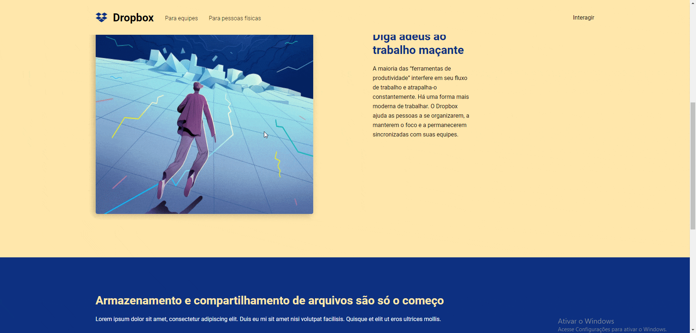

<h1 align="center">UI Clone - Dropbox.com</h1>
 
> Este projeto é de propósito estudantil, nenhum elemento nele contido deriva-se para usuários finais. Nenhuma informação aqui inserida será guardada ou repassada para terceiros.

<p align="center">	
<a href="https://www.linkedin.com/in/bruno-bach/">
  
  </a>
  

  <a aria-label="Completed" title="GitHub: Guilherme Rodz" alt="GitHub Guilherme Rodz" href="https://github.com/guilhermerodz">
    </img>
  </a>
  <a href="https://github.com/brunobach/proffy/commits/master">
    
  </a> 
  
   <a href="https://github.com/brunobach/proffy/stargazers">
    
  </a>
</p>
<p align="center">

<p align="center">
  <a href="#-Descrição">Descrição</a>&nbsp;&nbsp;&nbsp;|&nbsp;&nbsp;&nbsp;
  <a href="#-Projeto">Projeto</a>&nbsp;&nbsp;&nbsp;|&nbsp;&nbsp;&nbsp;
  <a href="#-Tecnologias">Tecnologias</a>&nbsp;&nbsp;&nbsp;|&nbsp;&nbsp;&nbsp;
  <a href="#-como-usar">Como Usar</a>&nbsp;&nbsp;&nbsp;|&nbsp;&nbsp;&nbsp;
  <a href="#-how-to-contribute">Como contribuir</a>&nbsp;&nbsp;&nbsp;|&nbsp;&nbsp;&nbsp;
  <a href="#memo-license">License</a>
</p>

## ✍ Descrição: Como funciona o projeto??

> UI Clone do site dropbox.com disponibilizado pelo [Guilherme Rodz](https://github.com/guilhermerodz) no canal da [Rocketseat](https://www.youtube.com/channel/UCSfwM5u0Kce6Cce8_S72olg).

Criação de um UI Clone em ReactJS do site dropbox.com, neste projeto foram utilizados conceitos responsivos de desenvolvimento. Tais como mobile first, entre técnicas em CSS como Clip, animation, transform entre outras.

<h1 align="center">
    
</h1>


<p align="center">

<a href="https://dropbox-clone-ui.netlify.app/">
    
</a>
<a href="https://github.com/brunobach/proffy/commits/master">
    
</a>

</p>

## 💻 Projeto : Estrutura

```bash
📂 -- ui-dropbox-clone
    |-- .gitignore
    |-- tsconfig.json
    |-- package.json
    ┗-- README.md
    📂 -- public
     |  |-- favico.ico
     |  |-- index.html
     |  |-- manifest.json
     |  ┗-- robots.txt
    📂 -- src
        |-- 📂 assets
        |  ┗-- landing.jpg
        |-- 📂 components
        |  |-- 📂 MenuForm
        |  |  |-- index.tsx
        |  |  ┗-- styles.ts
        |  |-- 📂 Section
        |  |  |-- index.tsx
        |  |  ┗-- styles.ts
        |  |-- 📂 SideMenu
        |  |  |-- index.tsx
        |  |  ┗-- styles.ts
        |-- 📂 data
        |  |  ┗-- index.ts
        |-- 📂 styles
        |     ┗-- GlobalStyles.ts
        |
        |-- index.tsx
        ┗-- App.tsx
```

## 🛸 Tecnologias

This project was developed with the following technologies:

| Check | Descriçao | Tecnologias |
|:---:|---------|:-----------:|
| [x]  |DropBox Clone|      |


## 🧰 Como usar

To clone and run this project, you'll need [Git](https://git-scm.com).

From your command line:

### 📥 Como baixar via cmd/terminal 

```bash
# Clone this repository
$ git clone https://github.com/brunobach/Dropbox-clone/

# Go into the repository
$ cd Dropbox-clone/src/public/

# Install dependencies
$ yarn or npm install

```

### 📲 Ou escaneie o codigo no seu dispositivo
<h1 align="center">
  
</h1>


## 🤔 Como contribuir

-  Make a fork;
-  Create a branch with your feature: `git checkout -b my-feature`;
-  Commit changes: `git commit -m 'feat: My new feature'`;
-  Make a push to your branch: `git push origin my-feature`.

_After merging your receipt request to done, you can delete a branch from yours_

## 📝 License

This project is under the MIT license. See the [LICENSE](https://github.com/brunobach/Dropbox-clone/blob/master/LICENSE) for details.

Made with by Bruno Bach :wave: [Get in touch!](https://www.linkedin.com/in/bruno-bach/)
